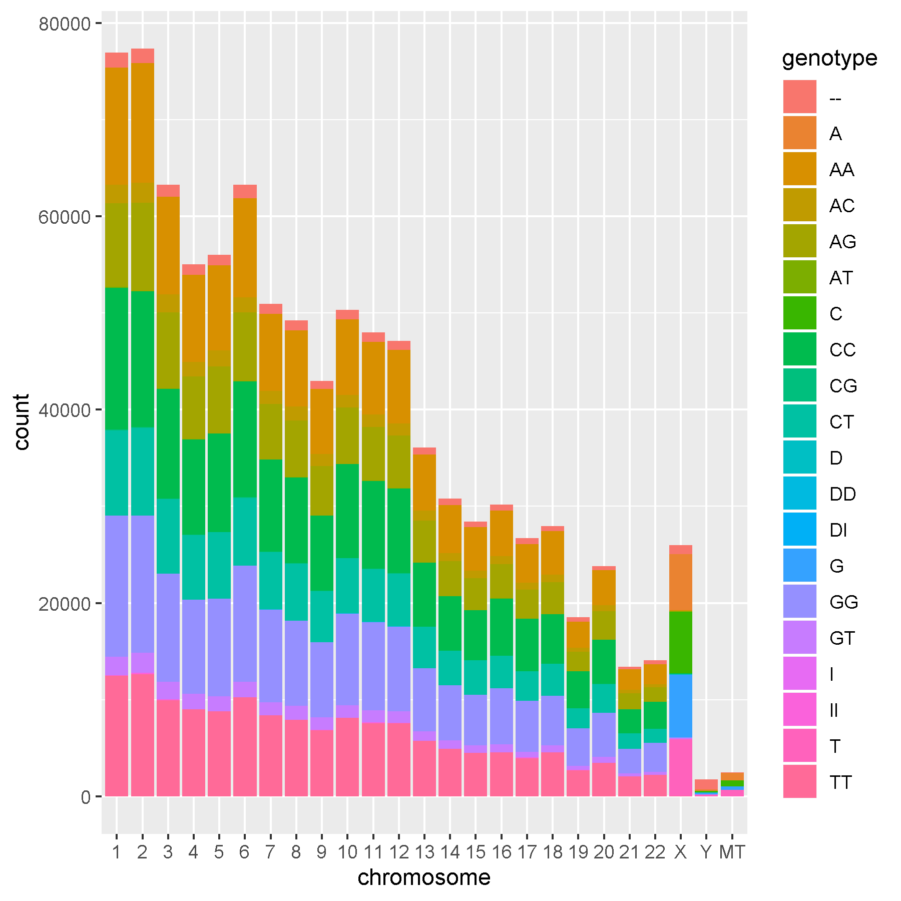

```{r setup, include=FALSE}
knitr::opts_chunk$set(echo = TRUE)
```

## Adding code chunk

use ctr + alt + !

## Accessing data

```{r}
#Loard Libraries
library(tidyverse)
```

```{r}
# Importing from your data directory from within your working directory

SNPs<- read.table("data/23andMe_example_cat25.txt", header = TRUE, sep = "\t")

```

## getting images for RMarkdown


```{r}
# Importing from your images directory from within your working directory
# This command is put OUTSIDE the r code chunk

```

 

## getwd()

```{r}

getwd()

```


```{r, echo=FALSE, eval=FALSE} 
# Importing from your data directory from any location
SNPs<- read.table("/home/jlb/jlb@umass.edu/GoEcology/Courses/583-AdvGen/2020_Spring/GenomeAnalysisR/data/23andMe_example_cat25.txt", header = TRUE, sep = "\t")

```

Setting up for data carpentry exercises: https://datacarpentry.org/R-ecology-lesson/03-dplyr.html

```{r}
 download.file(url="https://ndownloader.figshare.com/files/2292169",
              destfile = "data/portal_data_joined.csv")

surveys <- read_csv("data/portal_data_joined.csv")

str(surveys)

#View(surveys)


```
```{r}
select(surveys, plot_id, species_id, weight)
#select against certain with (-)
select(surveys, -record_id, -species_id)
```

```{r}
filter(surveys, year==1995)
```


 select() : subset columns
 filter() : subset rows on conditions
 mutate() : create new columns by using information from othr columns
 group_by() and summarize() : create summary stats on grouped data
 arrange() : sort results
 count() : count discrete values
 
## pipes
 
Want to select and filter at same time?

either:
1.use intermediate steps
2. nested functions
3. PIPES
 
```{r}
#intermediate steps can clutter workspace
surveys2 <- filter(surveys, weight < 5)
surveys_sml <- select(surveys2, species_id, sex, weight)


#nested functions can get hard to read
surveys_sml <- select(filter(surveys, weight < 5), species_id, sex, weight)

# piping takes output of one function and sends to next

#use ctrl+shift+m for a pipe

surveys %>% 
  filter(weight < 5) %>% 
  select(species_id, sex, weight)

# can assign it to new object if wanted

surveys_sml <- surveys %>%
  filter(weight < 5) %>%
  select(species_id, sex, weight)

surveys_sml

```
 
## Mutation Station

To create new column based on existing values

```{r}
surveys %>% 
  mutate(weight_kg= weight/1000)

# or add on using newly created column

surveys %>% 
  mutate(weight_kg=weight / 1000,
         weight_lb=weight_kg * 2.2)

#works with non-dplyr funcs too
surveys %>%
  mutate(weight_kg = weight / 1000) %>%
  head()

# or get rid of NA's in weight col
surveys %>%
  filter(!is.na(weight)) %>%
  mutate(weight_kg = weight / 1000) %>%
  head()

```

## Split-apply-combine approach

split data into groups, apply analysis to ach group, combine results

Easy(ish) to do with group_by()

```{r}
surveys %>% 
  group_by(sex) %>% 
  summarise(mean_weight=mean(weight, na.rm=TRUE))

```
```{r}
#group by multiple columns
surveys %>% 
  group_by(sex, species_id) %>% 
  summarise(mean_weight=mean(weight,na.rm = TRUE)) # leaves behind a NaN

# complete missing value removal
surveys %>%
  filter(!is.na(weight)) %>%
  group_by(sex, species_id) %>%
  summarize(mean_weight = mean(weight))

surveys %>%
  filter(!is.na(weight)) %>%
  group_by(sex, species_id) %>%
  summarize(mean_weight = mean(weight)) %>%
  print(n = 15)

# summarize multiple variables
surveys %>%
  filter(!is.na(weight)) %>%
  group_by(sex, species_id) %>%
  summarize(mean_weight = mean(weight),
            min_weight = min(weight))

# arrange results based on created variable

surveys %>%
  filter(!is.na(weight)) %>%
  group_by(sex, species_id) %>%
  summarize(mean_weight = mean(weight),
            min_weight = min(weight)) %>%
  arrange(min_weight)
# use desc() for descending order
# arrange(desc(mean_wight))

```

###counting
shorthand for group by variabl

```{r}
surveys %>% 
  count(sex)

#same as
surveys %>% 
  group_by(sex) %>% 
  summarise(count=n())

surveys %>% 
  count(sex,sort=TRUE)

# count combination of factors
surveys %>% 
  count(sex, species)

#and arrange as w want
surveys %>%
  count(sex, species) %>%
  arrange(species, desc(n))

```

## Reshaping with gather + spread

Come back to this later.

#Exercises

### challenge Q's

```{r}

surveys %>% 
  filter(year < 1995) %>% 
  select(year, sex, weight)

```

```{r}
surveys %>% 
  filter(!is.na(hindfoot_length)) %>% 
  mutate(hindfoot_half = hindfoot_length / 2) %>%
  filter(hindfoot_half < 30) %>% 
  select(species_id, hindfoot_half)
```

```{r}
surveys %>% 
  count(plot_type)

#surveys %>% 
#  group_by(species_id) %>% 
#  summarise(meanhfl=mean(hindfoot_length),
#            minhfl=min(hindfoot_length),
#           maxhfl= max(hindfoot_length),
#           n = n(hindfoot_length))


surveys %>% 
  filter(!is.na(weight)) %>% 
  select(year, genus, species_id, weight) %>% 
  group_by(year) %>% 
  filter(weight==max(weight)) %>% 
  arrange(year)
```

```{r}

```


### class exercises

```{r}
SNPs <- read_tsv("data/23andMe_complete.txt", skip = 14, col_types = 
  cols(chromosome = col_factor()))
```


## Exercise 1
Subset (select) the 23andMe Complete table to just position and genotype

```{r}

SNPs %>% 
  select(position, genotype) %>% 
  print(n=10)

```

##Exercise 2
Filter to just the MT chromosome and remove genotypes A and T. (you can use != to remove).

```{r}
SNPs %>% 
  filter(genotype !="A",
         genotype !="T",
         chromosome =="MT") %>% 
  print(n=10)
  
```

## Exercise 3

Use group_by() and summarize() to find the min positon, max position and total number of positions for each chromosomes.

```{r}

SNPs %>% 
  filter(!is.na(chromosome)) %>% 
  group_by(chromosome) %>% 
  summarize(minpos=min(position),
            maxpos=max(position),
            npos = n())


```
 

## Exercise 4

Building on ex3 create using mutate a new column with the density of SNPs for each chromosome based the total number of SNPs divided by the max position - min position

```{r}
SNPs %>% 
  filter(!is.na(chromosome)) %>% 
  group_by(chromosome) %>% 
  summarize(minpos=min(position),
            maxpos=max(position),
            npos = n()) %>% 
  mutate(density=npos/(maxpos-minpos)) %>% 
  print(n=10)


```

## Exercise 5

Building on ex3 sort chromosomes based on SNP density.

```{r}
SNPs %>% 
  filter(!is.na(chromosome)) %>% 
  group_by(chromosome) %>% 
  summarize(minpos=min(position),
            maxpos=max(position),
            npos = n()) %>% 
  mutate(density=npos/(maxpos-minpos)) %>%
  arrange(desc(density)) %>% 
  print(n=10)


```

##Exercise 6

Export the above table as a csv file to your data directory (There will be no results except the code to show me). However you will get an error when knitting if the code is not correct.

```{r}
newsnps<- SNPs %>% 
  filter(!is.na(chromosome)) %>% 
  group_by(chromosome) %>% 
  summarize(minpos=min(position),
            maxpos=max(position),
            npos = n()) %>% 
  mutate(density=npos/(maxpos-minpos)) %>%
  arrange(desc(density))


write.csv(newsnps,
          "data/newsnps.csv")

```

